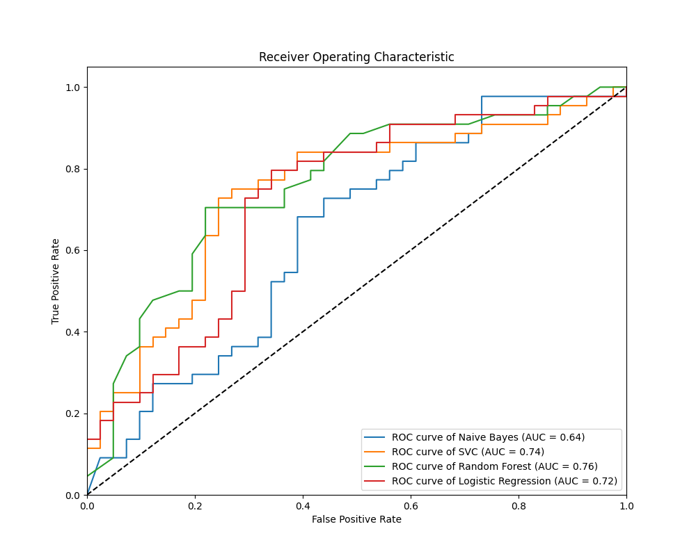

# Credit Risk Prediction with Machine Learning

Leveraging the power of machine learning, this project transforms credit risk evaluation, enabling more informed and strategic decision-making in the financial sector.Four machine learning models - **Naive Bayes**, **Support Vector Machine**, **Random Forest**, and **Logistic Regression** - were trained and evaluated using a dataset from Midwestern State University, Texas.

## Key Outcomes

- **Model Selection:** Random Forest and Support Vector Classifier (SVC) models performed well and were selected for further optimization through hyperparameter tuning.
- **Performance:** Random Forest showed robustness and a good trade-off between accuracy and AUC.
- **Insights:** The project underscores the critical role of machine learning in credit risk assessment and highlights important considerations for future work.

## Technical Implementation

This project was implemented using Python, primarily leveraging the **'pandas'** library for data manipulation and analysis, **'scikit-learn'** for executing machine learning tasks, and **'matplotlib'** for data visualization.

The codebase is organized into two Python (.py) files which are uploaded in this repository:

- Credit_Risk_Models.py: Contains all functions related to data cleaning, preprocessing, training and model building.  
- Fine_tuning.py: Includes the code for Grid search hyperparameter finding, K-fold cross-validation, fine-tuning and visualizing results.

An Excel file, W4.1_CreditRisk.xls, providing the raw data for the project, is also a part of this repository. This dataset is processed and used in the training and evaluation of the models.

These Python scripts were developed and tested in the PyCharm Integrated Development Environment (IDE). For those who wish to replicate the setup to this project, it is suggested to use PyCharm or a comparable Python-friendly IDE. Ensure that the W4.1_CreditRisk.xls file is located in the same directory as the Python scripts for proper execution.
Please note that you might need to install certain Python packages if they are not already installed in your Python environment. 

## Getting Started

Please see the [detailed documentation](https://github.com/Phyo-Wai-Yan-Win/Credit-Risk-Prediction/blob/main/documentation.md) for a comprehensive overview of the project, including:

- Data preprocessing steps
- Machine learning model training and evaluation
- Hyperparameter tuning  
- Results of the optimized models
- Future considerations and limitations

## Results

Results of the model comparisons as follow:

  

